<div align="center">
  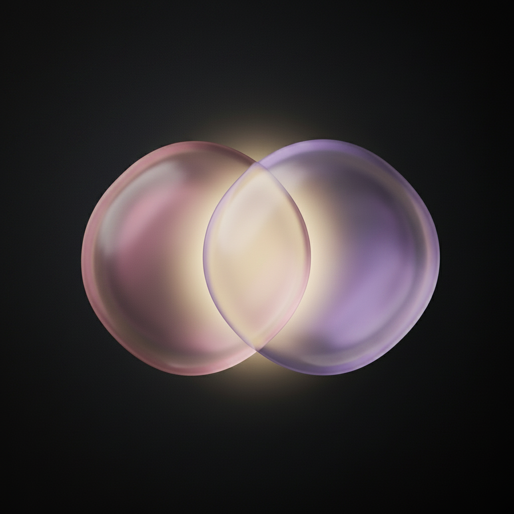
  <h1>Between 💙</h1>
  <p><i>A little space to stay close to the people who matter most.</i></p>
</div>

Between is a personal project built around a simple idea: staying connected with the people we care about shouldn't feel difficult, even when life gets busy.

In a world where conversations get lost in notifications and days pass without meaningful interaction, Between aims to make it easier to maintain relationships, share moments, and feel closer to the people who matter.

The goal is to create a simple, thoughtful, and user-friendly experience that puts meaningful connections at the center.

## 📱 Screenshots

<table align="center">
  <tr>
    <td>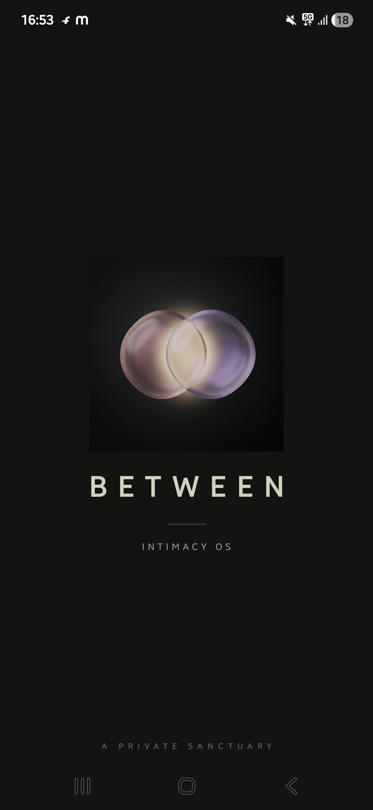</td>
    <td>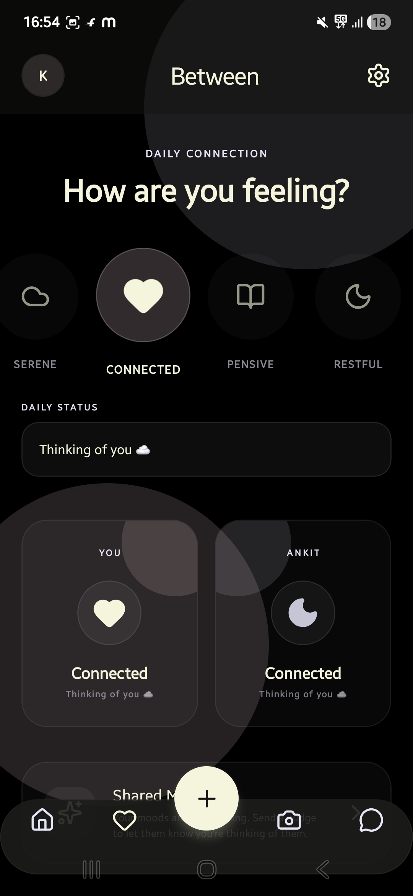</td>
    <td>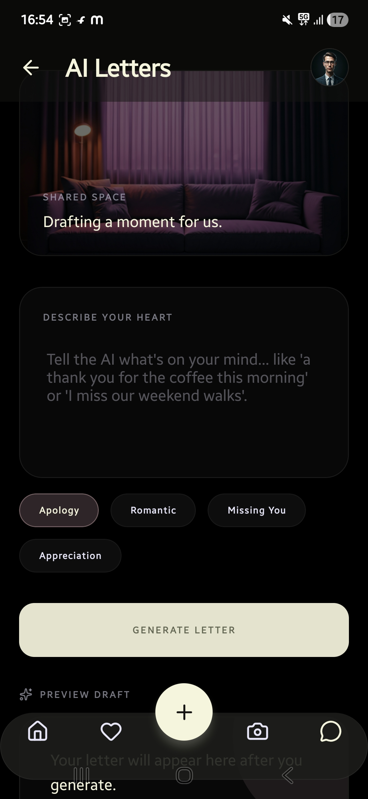</td>
  </tr>
  <tr>
    <td>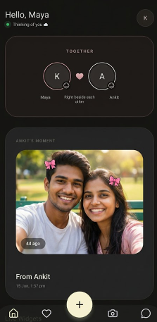</td>
    <td>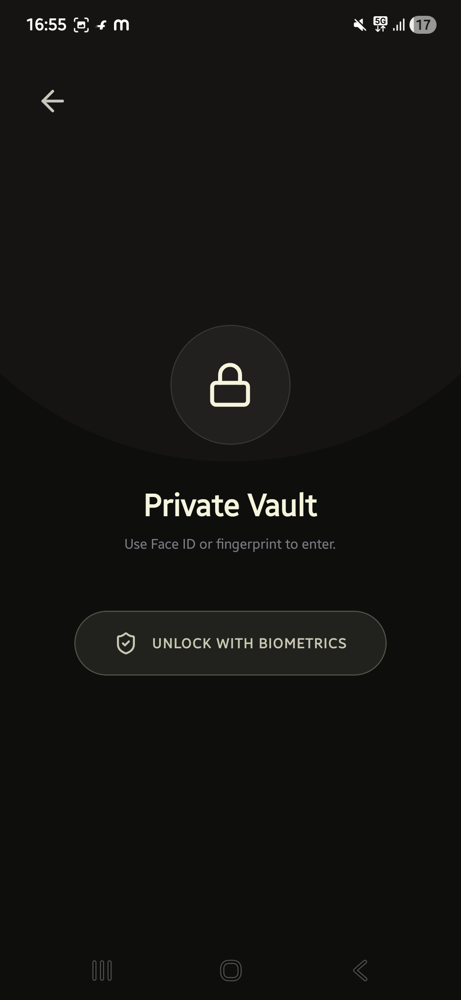</td>
    <td>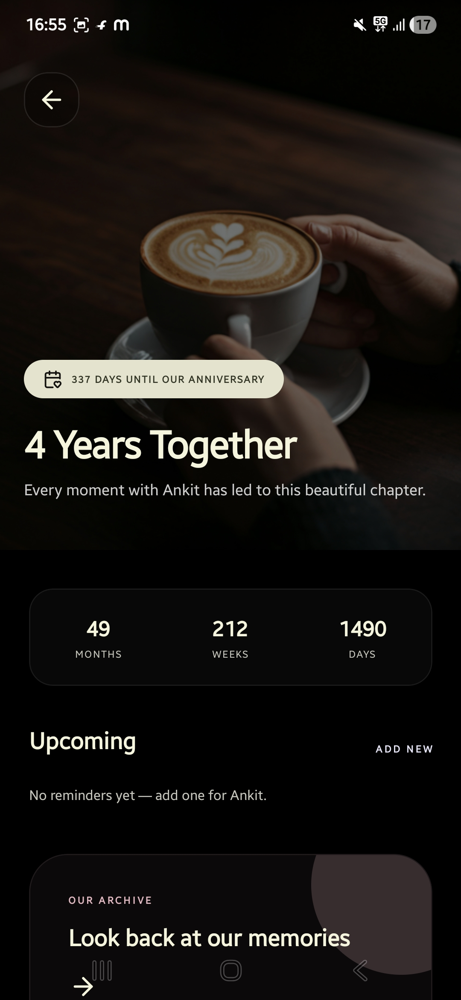</td>
  </tr>
  <tr>
    <td>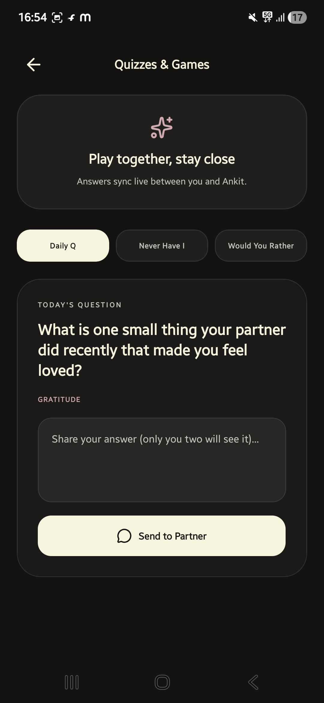</td>
    <td>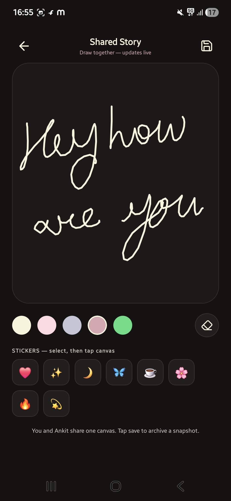</td>
    <td></td>
  </tr>
</table>

## ✨ About the Project
Between explores how technology can help people maintain stronger personal connections. Rather than focusing on endless feeds or public engagement, the concept centers on the smaller interactions that make relationships meaningful.

Whether it's checking in on someone, sharing a moment from your day, or remembering to reach out, the project is inspired by the little things that help relationships grow.

## 🎯 Project Goals
- **Meaningful Connections:** Encourage people to stay connected with friends, family, and loved ones.
- **Simple Experience:** Keep the interface intuitive and easy to navigate.
- **Personal Interaction:** Focus on personal moments and conversations rather than public attention.
- **Thoughtful Design:** Create an experience that feels welcoming, calm, and human-centered.
- **Room to Grow:** Build a foundation that can support additional features over time.

## 🚀 Features
- **Personalized Experience** — An interface centered around individual users and their connections.
- **Sharing Moments** — A way to share updates or meaningful moments with people who matter.
- **Connection Management** — A space to organize and maintain personal relationships.
- **Clean User Interface** — A simple layout designed to keep the experience approachable.

## 💡 Why Between?
Relationships are built through small, consistent interactions. A quick message, a shared memory, or a simple check-in can mean more than we realize.

Between is an exploration of how software can support those moments without making connection feel like another task on a to-do list.

The name represents the space between people — and how technology can help make that space feel a little smaller.

## 🛠️ Tech Stack
- **Frontend:** React Native, Expo
- **Styling:** React Native Stylesheets
- **Backend / Database:** Firebase (Firestore & Authentication)
- **State Management:** React Context API & AsyncStorage

## ⚙️ Getting Started
Follow these steps to run the project locally.

### Prerequisites
- Git
- Node.js and npm
- Expo CLI
- A code editor, such as VS Code

### 1. Clone the repository
```bash
git clone https://github.com/Komalgiri/Between.git
```

### 2. Navigate to the project directory
```bash
cd Between
```

### 3. Install dependencies
```bash
npm install
```

### 4. Start the development server
```bash
npx expo start
```
Open the application in your iOS Simulator, Android Emulator, or scan the QR code using the Expo Go app on your physical device.

## 📁 Project Structure
```text
Between/
├── src/
│   ├── components/  # Reusable UI components
│   ├── context/     # React Context for global state
│   ├── navigation/  # Navigation configuration
│   ├── screens/     # Application screens (Home, Vault, etc.)
│   ├── readme_assets/# Images for README
│   └── App.tsx      # Main application component
├── app.json         # Expo configuration
├── package.json     # Project dependencies and scripts
└── README.md        # Project documentation
```

## 🔄 User & System Flows

### 1. User Authentication Flow
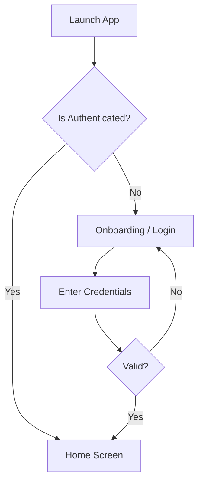

### 2. Core Interaction Flow (Sharing a Moment)
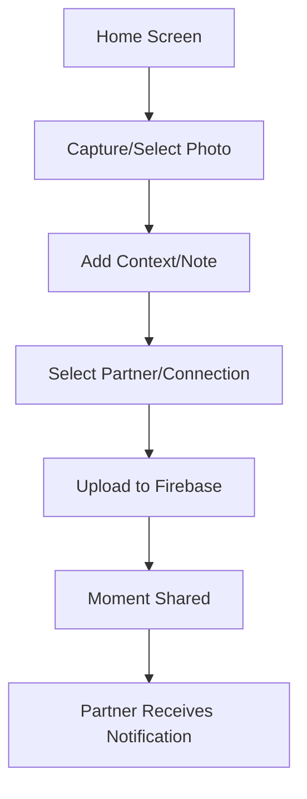

### 3. Private Vault System Flow
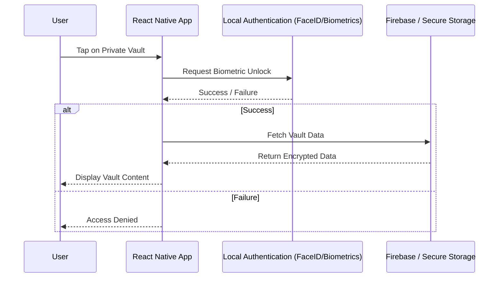

## 🗺️ Roadmap
- Refine the user experience and visual design.
- Develop core connection-focused functionality.
- Add personalized interactions and sharing capabilities.
- Explore private spaces for friends, families, or partners.
- Introduce reminders for meaningful check-ins.
- Improve accessibility, responsiveness, and performance.
- Add appropriate testing and documentation.

## 🌱 Project Status
Between is a personal development project focused on exploring a more thoughtful approach to digital connection. Its features and direction may evolve as development progresses.

## 👩‍💻 Author
**Komal Giri**
- GitHub: [@Komalgiri](https://github.com/Komalgiri)
- Portfolio: [portfolio-komalgiri.onrender.com](https://portfolio-komalgiri.onrender.com/)
- LinkedIn: [Komal Giri](https://www.linkedin.com/in/komal-giri-52798a265/)

## 🤝 Contributions
Suggestions, ideas, and constructive feedback are welcome. If you would like to contribute, you can fork the repository, create a feature branch, and submit a pull request describing your changes.

## 📄 License
A license has not yet been specified.

---
*Built with care by Komal Giri. 💙*  
*Because sometimes, the most meaningful things happen in the space between us.*
